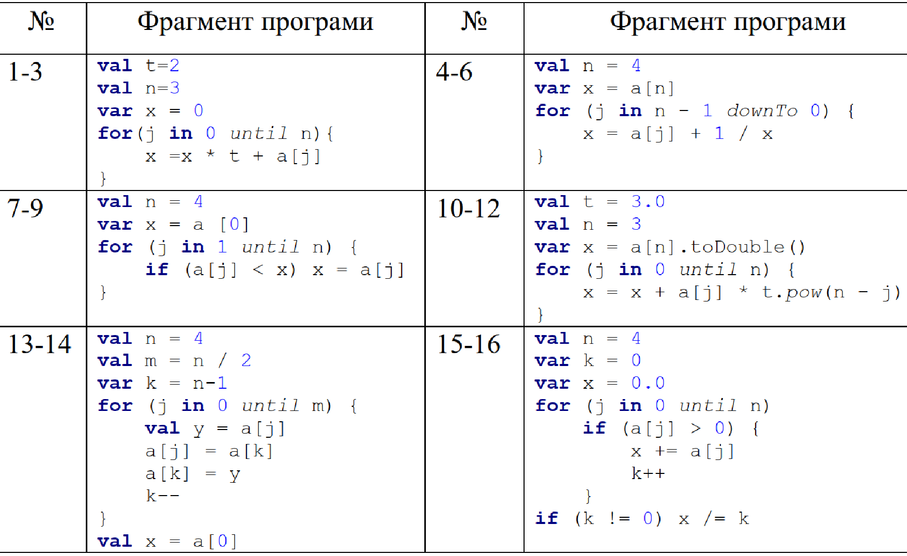

= Лабораторна робота №5

== Списки

Починаючи з цієї роботи ми починаємо вивчення складених типів даних, що складаються з декількох елементів простих типів.
Такі типи дуже часто необхідні в програмуванні.
Розглянемо, наприклад, задачу про пошук всіх коренів біквадратного рівняння ax^4^ + bx^2^ + c = 0.

Чи можна написати функцію, яка цю задачу вирішить?
Звичайно, так, але результатом подібної функції повинен бути __список__ знайдених коренів біквадратних рівняння.
__Список__ - це і є один з дуже поширених складених типів з наступними властивостями:

* Список може включати в себе будь-яку кількість __елементів__ (від нуля до нескінченності);
* Кількість елементів у списку називається його розміром;
* Всі елементи списку мають один і той же тип (в свою чергу, цей тип може бути простим - список дійсних чисел,
або складеним - список рядків, або список списків цілих чисел, або будь-які інші варіанти);
* В іншому елементи списку незалежні один від одного.

Розглянемо рішення задачі про пошук коренів біквадратних рівняння на Котліні:

[source,kotlin]
----
fun biRoots(a: Double, b: Double, c: Double): List<Double> {
    if (a == 0.0) {
        if (b == 0.0) return listOf()
        val bc = -c / b
        if (bc < 0.0) return listOf()
        val root = sqrt(bc)
        return if (root == 0.0) listOf(root) else listOf(-root, root)
    }
    val d = discriminant(a, b, c)
    if (d < 0.0) return listOf()
    val y1 = (-b + sqrt(d)) / (2 * a)
    val y2 = (-b - sqrt(d)) / (2 * a)
    // part1: List<Double>
    val part1 = if (y1 < 0) listOf() else if (y1 == 0.0) listOf(0.0) else {
        val x1 = sqrt(y1)
        listOf(-x1, x1)
    }
    // part2: List<Double>
    val part2 = if (y2 < 0) listOf() else if (y2 == 0.0) listOf(0.0) else {
        val x2 = sqrt(y2)
        listOf(-x2, x2)
    }
    return part1 + part2
}
----

Це рішення побудовано за алгоритмом, що описаний нижче:

. Перший **if** розглядає тривіальний випадок `a = 0` і більш просте рівняння `bx^2^ = -c`.
Воно або не має коренів (`с / b > 0`), або має один корінь `0` (`c / b = 0`), або два кореня (`c / b < 0`).
. Потім ми робимо заміну `y = x^2^` та обчислюємо дискримінант d = b^2^ - 4ac. Якщо він від'ємний, рівняння не має коренів.
. Якщо дискримінант дорівнює 0, рівняння ay^2^ + by + c = 0 має один корінь. Залежно від його знака,
біквадратне рівняння або не має коренів, або має один корінь 0, або має два кореня.
. В іншому випадку дискримінант додатний і рівняння ay^2^ + by + c = 0 має два корені.
Кожен з них, в залежності від його знака, перетворюється в нуль, один або два корені біквадратних рівняння.

Подивіться на тип результату функції `biRoots` - він зазначений як `List<Double>`.
`List` в Котліні - це і є список.
У кутових дужках `<>` вказується так званий __типовий аргумент__ - тип елементів списку, тобто `List<Double>`
разом - це список дійсних чисел.

Для створення списків, зручно використовувати функцію `listOf()`.
Аргументи цієї функції - це елементи створюваного списку, їх може бути будь-яка кількість (в тому числі 0).
У ряді випадків, коли біквадратне рівняння не має коренів, функція `biRoots` повертає порожній список результатів.

В останньому, самому складному випадку, коли рівняння ay^2^ + by + c = 0 має два корені y~1~ і y~2~,
ми формуємо рішення рівнянь x^2^ = y~1~ і x^2^ = y~2~ у вигляді списків part1 і part2.
Обидві ці проміжні змінні мають тип `List <Double>` -
в цьому можна переконатися в IDE, поставивши на них курсор введення і натиснувши комбінацію клавіш `Ctrl + Q`.
В останньому операторі **return** ми **складаємо** два цих списки один з одним: `return part1 + part2`,
утворюючи таким чином третій список, що містить в собі всі елементи двох попередніх.

Функцію `biRoots` можна дещо спростити, звернувши увагу на те,
що ми в ній **чотири** рази вирішуємо одну і ту ж задачу: пошук коренів рівняння x^2^ = y.
Для програміста така ситуація повинна відразу перетворюватися в сигнал -
**слід** написати для вирішення цього завдання окрему, більш просту функцію:

[source,kotlin]
----
fun sqRoots(y: Double) =
        if (y < 0) listOf()
        else if (y == 0.0) listOf(0.0)
        else {
            val root = sqrt(y)
            // Результат!
            listOf(-root, root)
        }
----

Подивіться уважніше на оператор ** if..else if..else **.
Перші дві його гілки формують результат відразу ж, використовуючи `listOf()` і `listOf(0.0)`.
А ось гілка **else** спочатку створює проміжну змінну `root` і вже потім формує результат `listOf(-root, root)`.
Запам'ятайте: результат гілки в таких випадках формує **останній** її оператор.

Цю ж функцію можна переписати з використанням оператора **when**:

[source,kotlin]
----
fun sqRoots(y: Double) =
        when {
            y < 0 -> listOf()
            y == 0.0 -> listOf(0.0)
            else -> {
                val root = sqrt(y)
                // Результат!
                listOf(-root, root)
            }
        }

----

З використанням `sqRoots` функція `biRoots` прийме наступний вигляд:

[source,kotlin]
----
fun biRoots(a: Double, b: Double, c: Double): List<Double> {
    if (a == 0.0) {
        return if (b == 0.0) listOf()
        else sqRoots(-c / b)
    }
    val d = discriminant(a, b, c)
    if (d < 0.0) return listOf()
    if (d == 0.0) return sqRoots(-b / (2 * a))
    val y1 = (-b + sqrt(d)) / (2 * a)
    val y2 = (-b - sqrt(d)) / (2 * a)
    return sqRoots(y1) + sqRoots(y2)
}
----

З вихідних 24 рядків залишилося тільки 11, та й розуміння тексту функції стало значно простіше.

Напишемо тепер тестову функцію для перевірки роботи функції `biRoots`.
Для цієї мети послідовно вирішимо з її допомогою такі рівняння:

* 0x^4^ + 0x^2^ + 1 = 0 (коренів немає)
* 0x^4^ + 1x^2^ + 2 = 0 (коренів немає)
* 0x^4^ + 1x^2^ - 4 = 0 (корені -2, 2)
* 1x^4^ - 2x^2^ + 4 = 0 (коренів немає)
* 1x^4^ - 2x^2^ + 1 = 0 (корені -1, 1)
* 1x^4^ + 3x^2^ + 2 = 0 (коренів немає)
* 1x^4^ - 5x^2^ + 4 = 0 (корені -2, -1, 1, 2)

[source,kotlin]
----
fun biRootsTest() {
    assertEquals(listOf<Double>(), biRoots(0.0, 0.0, 1.0))
    assertEquals(listOf<Double>(), biRoots(0.0, 1.0, 2.0))
    assertEquals(listOf(-2.0, 2.0), biRoots(0.0, 1.0, -4.0))
    assertEquals(listOf<Double>(), biRoots(1.0, -2.0, 4.0))
    assertEquals(listOf(-1.0, 1.0), biRoots(1.0, -2.0, 1.0))
    assertEquals(listOf<Double>(), biRoots(1.0, 3.0, 2.0))
    assertEquals(listOf(-2.0, -1.0, 1.0, 2.0), biRoots(1.0, -5.0, 4.0))
}
----

Зверніть увагу, що тут ми використовуємо запис `listOf<Double>()` для створення порожнього списку.
Справа в тому, що для викликів на кшталт `listOf(-2.0, 2.0)`
тип елементів створюваного списку зрозумілий з аргументів функції - це `List<Double>`.
А ось виклик `listOf()` без аргументів не дає ніякої інформації про тип елементів списку,
в той же час, наприклад, порожній список рядків і порожній список цілих чисел - з точки зору Котліна не одне і те ж.

У багатьох випадках Котлін, тим не менш, може зрозуміти, про який список йде мова.
Наприклад, функція `biRoots` має результат `List<Double>`,
а значить, все списки, які використовуються в операторах **return**, повинні мати такий же тип.
Випадок з викликом `assertEquals`, однак, не несе достатньої інформації, щоб зрозуміти тип елементів,
і ми змушені записати виклик функції більш детально - `listOf<Double>()`, вказуючи __типовий аргумент__ `<Double>`
**між** ім'ям функції, що викликається і списком її аргументів в круглих дужках.

Запустимо тепер написану тестову функцію. Ми отримаємо провалений тест через останню перевірку:
[source]
----
org.opentest4j.AssertionFailedError: expected: <[-2.0, -1.0, 1.0, 2.0]> but was: <[-2.0, 2.0, -1.0, 1.0]>
----

Тобто ми очікували список коренів -2, -1, 1, 2, а отримали натомість -2, 2, -1, 1.
Справа в тому, що списки в Котліні вважаються рівними, якщо збігаються їх розміри, і відповідні елементи списків рівні.
Списки, що складаються з одних і тих же елементів, але на різних місцях, вважаються різними.

У цьому місці програміст повинен задуматися, а що, власне, він хоче в точності від функції `biRoots`.
Чи повинні знайдені корені бути впорядковані за зростанням, або вони можуть бути присутніми в списку в будь-якому порядку?
Якщо повинні, то він повинен виправити функцію `biRoots`, а якщо ні - то тестову функцію,
так як вона вимагає від тестованої функції більше, ніж та за фактом дає.

В обох випадках нам доведеться впорядкувати список знайдених коренів перед порівнянням.
У Котліні це можна зробити, викликавши функцію `.sorted ()`:

[source,kotlin]
----
fun biRootsTest() {
    // ...                                                               v
    assertEquals(listOf(-2.0, -1.0, 1.0, 2.0), biRoots(1.0, -5.0, 4.0).sorted())
}
----

Раніше ми вже зустрічалися з функціями з __одержувачем__ `.toInt ()` і `.toDouble ()`.
Функція `.sorted()` також вимагає наявності одержувача: виклик `list.sorted()` створює список того ж розміру,
що і вихідний, але його елементи будуть впорядковані за зростанням.

== Поширені операції над списками

Перерахуємо деякі операції над списками, що присутні в бібліотеці мови Котлін:

. `listOf(...)` -- створення нового списка.
. `list1 + list2` -- додавання двох списків, сума списків містить всі елементи їх обох.
. `list + element` -- додавання списку та елемента, сума містить всі елементи `list` і додатково `element`
. `list.size` -- отримання розміру списку (Int).
. `list.isEmpty()`, `list.isNotEmpty()` -- отримання ознак порожнечі і непорожнечі списку (Boolean).
. `list[i]` -- індексація, тобто отримання __елемента__ списку з цілочисельним __індексом__ (номером) `i`. За правилами
Котліна, в списку з `n` элементів вони мають індекси, що починаються з нуля: 0, 1, 2, ..., останній елемент списку має індекс `n - 1`.
Тобто, при використанні запису `list[i]` повинно бути справедливо `i >= 0 && i < list.size`.
Інакше виконання програми буде перерване з помилкою (використання індексу за межами списку).
. `list.sublist(from, to)` -- створення списку меншого розміру (підсписку), в який войдуть елементи списку `list` з індексами `from`, `from + 1`, ..., `to - 2`, `to - 1`.
Елемент з індексом `to` не включається.
. `element in list` -- перевірка приналежності елементу `element` списку `list`.
. `for (element in list) { ... }` -- цикл **for**, що перебирає всі елементи списку `list`.
. `list.first()` -- отримання першого елемента списку (якщо список порожній, виконання програми буде перервано з помилкою).
. `list.last()` -- отримання останнього елемента списку (аналогічно).
. `list.indexOf(element)` -- пошук індекса елемента `element` в списку `list`. Результат цієї функції дорівнює -1, якщо елемент в списку відсутній.
Інакше, при звертанні до списку `list` по обчисленому індексу ми отримаємо `element`.
. `list.min()`, `list.max()` -- пошук мінімального і максимального елемента в списку.
. `list.sum()` -- сума елементів в списку.
. `list.sorted()`, `list.sortedDescending()` -- побудова відсортованого списку (за зростанням, чи за спаданням) з поточного списка.
. `list1 == list2` -- порівняння двох списків на рівність. Списки рівні, якщо співпадають їхні розміри та відповідні елементи.

== Мутуючі списки

__Мутуючий список__ є різновидом звичайного, його тип визначається як `MutableList<ElementType>`.
На додаток до тих можливостей, які є у всіх списків в Котліні,
мутуючий список може змінюватися по ходу виконання програми або функції.
Це означає, що мутуючий список дозволяє:

. Змінювати свій вміст операторами `list[i] = element`.
. **Додавати** елементи в кінець списку, зі збільшенням розміру на 1: `list.add(element)`.
. **Видаляти** елементи зі списке, зі зменшенням розміру на 1 (якщо елемент був у списку): `list.remove(element)`.
. **Видаляти** елементи зі списку по індексу, зі зменшенням розміру на 1: `list.removeAt(index)`.
. **Вставляти** елементи в середину списку: `list.add(index, element)` -- вставляє елемент `element` по індексу `index`,
зсуваючи всі наступні елементи на 1, наприклад `listOf(1, 2, 3).add(1, 7)` дасть результат `[1, 7, 2, 3]`.

Для створення мутуючого списку можна використовувати функцію `mutableListOf(...)`, аналогічну `listOf(...)`.

Розглянемо приклад. Нехай є вихідний список цілих чисел `list`.
Потрібно побудувати список, що складається з його від'ємних елементів, порядок їх в списку повинен залишитися незмінним.
Для цього потрібно:

* Створити порожній мутуючий список
* Пройтися по всіх елементах вихідного списку і додати їх у мутуючий список, якщо вони від'ємні
* Повернути заповнений мутуючий список

[source,kotlin]
----
fun negativeList(list: List<Int>): List<Int> {
    val result = mutableListOf<Int>()
    for (element in list) {
        if (element < 0) {
            result.add(element)
        }
    }
    return result
}
----

Тут проміжна змінна `result` має тип `MutableList<Int>`
(Переконайтеся в цьому в IDE за допомогою комбінації `Ctrl + Q`).
Незважаючи на це, ми можемо використовувати її в операторі **return** функції з результатом `List<Int>`.
Відбувається це тому, що тип `MutableList<Int>` є різновидом типу `List<Int>`, тобто,
будь-який мутуючий список є також і просто списком (зворотне невірно - не будь-який список є мутуючим).
Мовою математики це означає, що ОДЗ (область допустимих значень) типу `MutableList<Int>`
є **підмножиною** ОДЗ типу `List<Int>`.

У наступному прикладі функція приймає на вхід вже **мутуючий** список цілих чисел,
і змінює в ньому все додатні числа на протилежні за знаком:

[source,kotlin]
----
fun invertPositives(list: MutableList<Int>) {
    for (i in 0 until list.size) {
        val element = list[i]
        if (element > 0) {
            list[i] = -element
        }
    }
}
----

Функція `invertPositives` не має результату.
Це ще один приклад функції з побічним ефектом, які вже зустрічалися нам раніше.
Єдиний сенс виклику даної функції - це зміна мутуючого списку, переданого їй як аргумент.

Зверніть увагу на заголовок циклу **for**.
Тут ми змушені перебирати не елементи списку, а їх індекси,
причому запис `i in 0 until list.size` еквівалентний `i in 0..list.size - 1`
(Використання `until` дещо краще, так як дозволяє уникнути зайвого віднімання одиниці).
Прямий перебір елементів списку в даному прикладі не проходить:

[source,kotlin]
----
fun invertPositives(list: MutableList<Int>) {
    for (element in list) {
        if (element > 0) {
            element = -element // Val cannot be reassigned - помилка!
        }
    }
}
----

Параметр циклу **for** є незмінним.
Записати тут `list [i] = -element` теж не вийде, оскільки індекс `i` нам невідомий.
Можливий, щоправда, ось такий, трохи більш хитрий запис, який перебирає елементи і індекси одночасно:

[source,kotlin]
----
fun invertPositives(list: MutableList<Int>) {
    for ((index, element) in list.withIndex()) {
        if (element > 0) {
            list[index] = -element
        }
    }
}
----

Використана тут функція `list.withIndex()` з вихідного списку формує інший список,
містить __пари__ (індекс, елемент),
а цикл `for ((index, element) in ...)` перебирає паралельно і елементи і їхні індекси.
Про те, що таке __пара__ і як їй користуватися в Котлін, ми докладніше поговоримо пізніше.

У загальному і цілому, рідко коли варто користуватися функціями, основний сенс яких полягає в зміні їхніх параметрів.
Подивіться, наприклад, як виглядає тестова функція для `invertPositives`:

[source,kotlin]
----
fun invertPositivesTest() {
    val list1 = mutableListOf(1, 2, 3)
    invertPositives(list1)
    assertEquals(listOf(-1, -2, -3), list1)
    val list2 = mutableListOf(-1, 2, 4, -5)
    invertPositives(list2)
    assertEquals(listOf(-1, -2, -4, -5), list2)
}
----

Якщо раніше в нас одна перевірка завжди займала один рядок,
то в цьому прикладі вона займає три рядки через необхідність створення проміжних змінних `list1` і `list2`.
Крім цього, факт зміни `list1`, `list2` при виклику `invertPositives` схильний вислизати від уваги читача,
ускладнюючи розуміння програми.

== Масиви

Масив **Array** - ще один тип, призначений для зберігання і модифікації деякої кількості однотипних елементів.
З точки зору можливостей, масив схожий на мутуючий список **MutableList**;
головною його відмінністю є відсутність можливості змінювати свій розмір -
для масивів відсутні функції `add` і `remove`.

Для звернення до елемента масиву служить оператор індексації: `array[i]`,
причому є можливість як читати вміст масиву, так і змінювати його.
Для створення масиву, зручно використовувати функцію `arrayOf()`, аналогічну `listOf()` для списків.

Майже всі можливості, наявні для списків, є і для масивів теж.
Винятком є функції для створення підсписків `sublist`.
Також, масиви не слід порівнювати на рівність за допомогою `array1 == array2`,
оскільки в багатьох випадках таке порівняння дає невірний результат (подробиці про це - в лекції).
Масив можна перетворити до звичайного списку за допомогою `array.toList()`
або до мутуючого списку за допомогою `array.toMutableList()`.
Список, в свою чергу, можна перетворити до масиву за допомогою `list.toTypedArray()`.

В цілому, при написанні програм на Котліні майже немає випадків, коли масиви використовувати необхідно.
Одним з небагатьох прикладів є головна функція, параметр якої має тип `Array<String>` -
через нього в програму передаються аргументи командного рядка.
Але в нових версіях Котліна цей параметр не є обов'язковим.

== Завдання 5.1

Представити математичний запис фрагмента програми та обчислити значення змінної `x` після його виконання.
Елементи масиву обчислюються за формулою `a[i+1] = (67 * a[i] + 11) % 128`.
Значення `a[0]` дорівнює номеру варіанта за списком групи.

== Завдання 5.2

Скласти програму обчислення наступних величин та виконати її у середовищі програмування.
Елементи списку (масиву) визначаються за формулою
`a[i] = p[i] – 64`; де `p[i+1] = (p[i] * 67 + 11) % 128`.
`p[0]` дорівнює `n` – номеру варіанта за списком групи, кількість елементів у списку дорівнює `50`.

=== Варіанти

. Найбільший елемент масиву a, та його порядковий номер

. Сума елементів масиву a, значення яких кратні N.

. Сума елементів масиву a, значення яких парні числа.

. Середнє арифметичне додатних елементів масиву a.

. Сума елементів масиву a, значення яких непарні числа.

. Середнє геометричне додатних елементів масиву a.

. Сума елементів масиву a, значення яких двозначні непарні числа.

. Добуток найбільшого та найменшого елементів масиву a.

. Сума елементів масиву a, значення яких двозначні парні числа

. Модуль вектора a/3

. Найменший елемент масиву a, з парним номером

. Найбільший непарний елемент масиву

. Сума від’ємних елементів масиву

. Сума квадратів елементів масиву з парними номерами

. Середнє арифметичне найбільшого та найменшого елементів з парними номерами

. Середнє арифметичне найбільшого парного та найменшого непарного елементів

== Завдання 5.3

["loweralpha"]
. Протабулювати функцію із завдання 4.2. Значення `x` та `y` занести у списки.
. Знайти найбільше, та найменше значення у списку `y`.
Вивести їх та відповідні їм значення з масиву `x` у наступному вигляді:
----
yMin = … при x = …
yMax = … при x = …
----
["loweralpha", start=3]
. Обчислити суму та середнє арифметичне значення елементів масиву `y`.
Результати вивести на екран.

